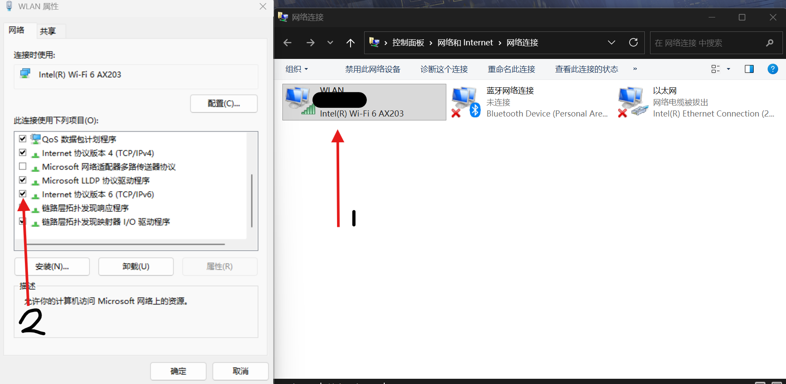
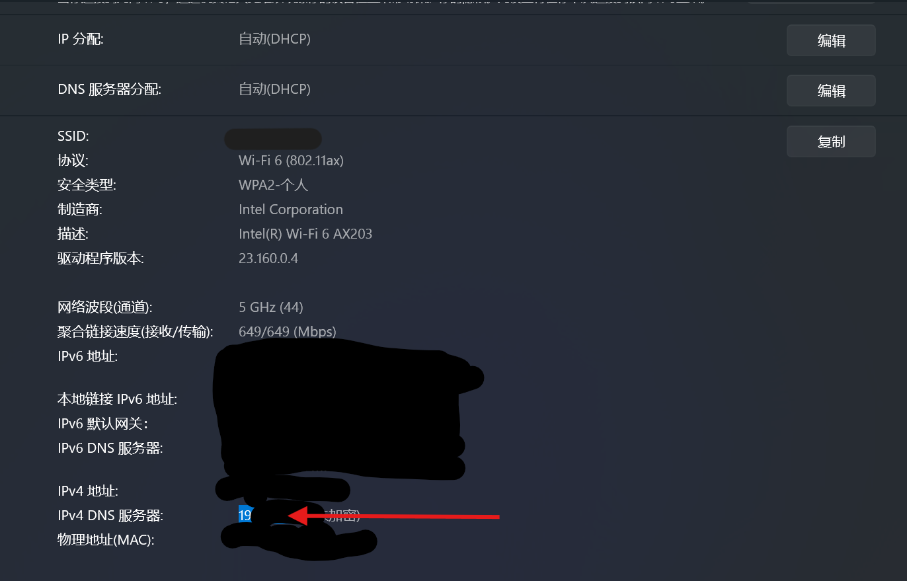
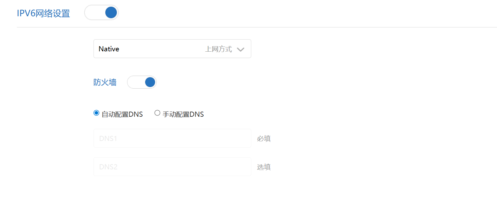
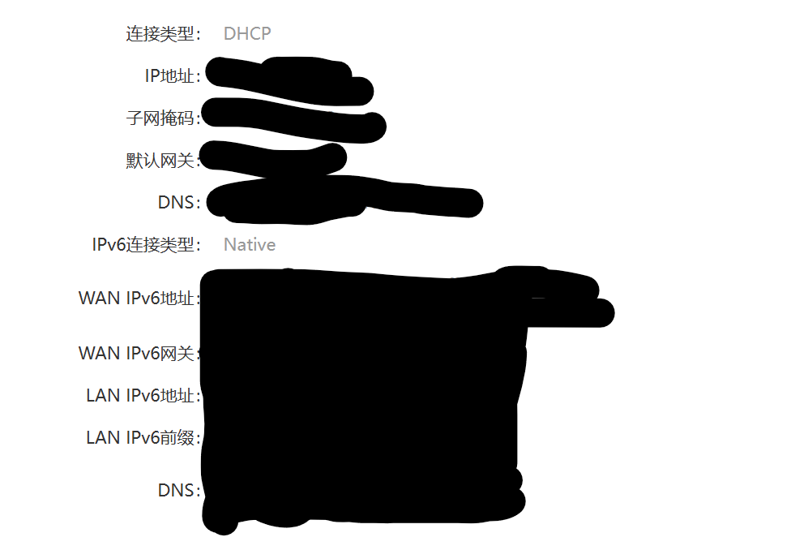
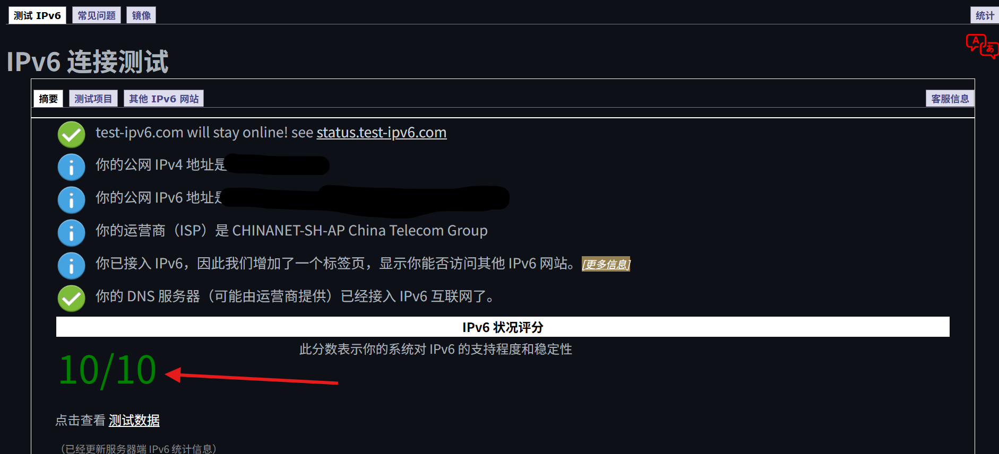

# IPv6 启用指南


<video width="100%" controls>
  <source src="./videos/IPv6-Activation-Guide.mp4" type="video/mp4">
  <p>您的浏览器不支持视频播放，请 <a href="./videos/IPv6-Activation-Guide.mp4">下载视频</a> 观看。</p>
</video>

*视频:视频版教程 1080p · 2分12秒 · 43MB

> **明明路由器说支持IPv6，网站也说支持，但你的电脑就是没用上？这份指南帮你一步步揪出真凶。**

## 目录
- [1. 检查你的系统是否启用了 IPv6](#1-检查你的系统是否启用了-ipv6)
  - [Windows](#windows)
  - [macOS](#macos)
  - [Linux (Ubuntu/Debian)](#linux-ubuntudebian)
- [2. 为路由器启用 IPv6](#2-为路由器启用-ipv6)
  - [如何进入路由器后台](#如何进入路由器后台)
  - [小米路由器 (MiWiFi)](#小米路由器-miwifi)
  - [TP-Link](#tp-link)
  - [华为路由器](#华为路由器)
- [3. 最终检查：你真的在用 IPv6 了吗？](#3-最终检查你真的在用-ipv6-了吗)
- [常见错误解决方法](#常见错误解决方法)
  - [配置完成，但测试网站未检测到 IPv6](#配置完成但测试网站未检测到-ipv6)
  - [路由器里找不到 IPv6 设置选项](#路由器里找不到-ipv6-设置选项)
  - [Windows 提示“无网络访问权限”](#windows-提示无网络访问权限)
- [免责声明](#%EF%B8%8F-免责与贡献声明)
- [其他](#其他)

## 1. 检查你的系统是否启用了 IPv6
这是最容易被忽略，也最致命的一步。如果你的系统压根没启用IPv6协议，后面所有步骤都是徒劳。

### Windows
1. 按 `Win + R`，输入 `ncpa.cpl` 并回车，快速打开“网络连接”。
2. 右键点击你正在使用的网络连接（如“WLAN”或“以太网”），选择 **“属性”**。
3. 在弹出的窗口中，找到并确认 **“Internet 协议版本 6 (TCP/IPv6)”** 这一项**已被勾选**。
   - **如果未勾选**：请勾选它，点击“确定”，并**重启电脑**。
   - **如果已勾选**：进行下一步。  
      
    *图:Windows 成功启用 IPv6 后

### macOS
1. 打开 **“系统设置” > “网络”**。
2. 选择当前使用的网络服务（如Wi-Fi），点击 **“详细信息...”**。
3. 切换到 **“TCP/IP”** 标签页。
4. 查看 **“配置 IPv6”** 一项，应设置为 **“自动”**。

### Linux (Ubuntu/Debian)
1. 打开终端。
2. 检查网卡是否已启用IPv6：
   ```bash
   cat /proc/sys/net/ipv6/conf/all/disable_ipv6
   ```
   - 如果输出为 **`0`**，表示已启用。
   - 如果输出为 **`1`**，表示被禁用。需要编辑 `/etc/sysctl.conf` 文件，确保包含 `net.ipv6.conf.all.disable_ipv6 = 0`，然后执行 `sudo sysctl -p` 生效。

## 2. 为路由器启用 IPv6
系统准备好了，现在轮到网络网关——你的路由器。

### 如何进入路由器后台
1. **找到路由器管理地址**：
   - **Windows**：按 `Win + I` 打开设置，找到 **“网络和 Internet” > “WLAN”**，进入 **“[你的网络名]属性”**。找到 **“IPv4 DNS 服务器”** 的IP地址（通常是 `192.168.x.1` 或 `10.0.x.1`）。
      
    *图:Windows 设置中的路由器后台IP页面
   - **通用方法**：查看路由器背面贴纸，通常标有管理地址（如 `miwifi.com`, `192.168.31.1`, `tplinkwifi.net`）。  
2. **访问后台**：在浏览器地址栏输入上一步找到的IP或网址，按回车。
3. **登录**：输入路由器密码（**通常就是你连接Wi-Fi的密码**）。如果从未改过，密码可能在路由器背面的贴纸上。

### 小米路由器 (MiWiFi)
1. 登录后，在左侧或顶部菜单找到 **“常用设置” > “上网设置”**。
2. 页面下滑，找到 **“IPV6 网络设置”**。
3. **启用** 开关，并等待设置完成。  
    
  *图:MiWiFi 启用 IPv6 后，IPv6　部分
5. **验证**：回到“上网设置”页面顶部，查看 **“上网信息”**。
   - **成功标志**：看到 **“IPv6 连接类型”**、**“WAN IPv6 地址”**、**“LAN IPv6 地址”** 等字段均**不为空**。
   - **如有字段为空**：请跳至 [常见错误解决方法](#常见错误解决方法)。  
      
    *图:MiWiFi启用 IPv6 后 上网信息部分

### TP-Link
1. 登录后，进入 **“高级设置” > “网络设置” > “IPv6”**。
2. 将 **“IPv6 功能”** 设置为 **“启用”**。
3. **“连接类型”** 通常选择 **“桥模式”** 或 **“动态获取(SLAAC/DHCPv6)”**（可咨询你的宽带运营商）。
4. 保存设置并重启路由器。

### 华为路由器
1. 登录后，进入 **“更多功能” > “网络设置” > “IPv6”**。
2. 开启 **“IPv6 开关”**。
3. **“连接方式”** 一般选择 **“自动获取”**。
4. 保存即可。

## 3. 最终检查：你真的在用 IPv6 了吗？
完成以上设置后，进行终极测试。

1.  访问权威测试网站：**[https://test-ipv6.com](https://test-ipv6.com)**。
2.  等待页面自动完成测试。
3.  查看结果：
    - **🎉 分数为 10/10**：恭喜！你的设备正在完美使用 IPv6 访问互联网。
    - **😰 分数低于 10/10**：说明仍有问题。最常见的情况是“配置完成，但未检测到IPv6”，请跳至 [常见错误解决方法](#常见错误解决方法)。  
        
      *图:test-ipv6 10分状态(IPv6 已成功启用)

## 常见错误解决方法

### 有字段为空
## 常见错误解决方法

### 有字段为空（路由器显示不全）
如果在路由器的“上网信息”中，**IPv6相关字段有空白**（如“WAN IPv6地址”为空），说明IPv6连接未完全建立。

#### 可能原因及解决方法：

**1. 运营商未分配IPv6地址**
- 你的宽带可能尚未开通IPv6服务
- **解决方法**：联系运营商客服（电信10000/联通10010/移动10086），要求：“请为我的宽带开通IPv6功能”

**2. 路由器获取地址失败**
- 路由器与光猫之间的IPv6协商失败
- **解决方法**：
  1. 重启光猫和路由器（拔电源等10秒）
  2. 在路由器IPv6设置中，尝试切换“连接类型”（如从“自动”改为“桥接”或反之）
  3. 将光猫改为桥接模式，用路由器拨号（需要向运营商获取宽带账号密码）

**3. 光猫不支持或配置错误**
- 老旧光猫可能不支持IPv6
- **解决方法**：
  1. 查看光猫型号，搜索是否支持IPv6
  2. 联系运营商要求**免费更换**支持IPv6的光猫
  3. 进入光猫后台（地址通常为`192.168.1.1`），检查IPv6设置

#### 如果以上都无效：
- 在本项目 [GitHub Issues](https://github.com/qiufengcute/IPv6-Activation-Guide/issues) 提问
- 提供：运营商名称 + 路由器型号 + 光猫型号

**记住**：如果运营商推诿或收费，可向 **[工信部](https://www.miit.gov.cn)** 投诉，这是最有效的解决方法。（**前提条件:必须已经向运营商投诉过，且对结果不满意或在15天内未得到解决**）

### 配置完成，但测试网站未检测到 IPv6
1.  **重启大法**：
    - 在系统设置中“忘记”当前Wi-Fi网络，然后重新连接。
    - **重启你的路由器和光猫**（拔掉电源，等待10秒再插上）。
    - 最后重启你的电脑/手机。
2.  **清除DNS缓存**：
    - **Windows**：以管理员身份打开命令提示符，输入 `ipconfig /flushdns` 并回车。
    - **macOS/Linux**：打开终端，输入 `sudo killall -HUP mDNSResponder` (macOS) 或 `sudo systemd-resolve --flush-caches` (Linux)。
3.  **检查防火墙/安全软件**：暂时禁用第三方防火墙或安全软件，看是否是其阻止了IPv6连接。

### 路由器里找不到 IPv6 设置选项
- **可能性1：路由器固件太旧**。尝试在路由器后台检查并升级到最新固件。
- **可能性2：路由器硬件不支持**。较老的低端路由器可能不支持IPv6，考虑更换。
- **可能性3：设置位置不同**。尝试在“高级设置”、“网络设置”、“互联网设置”等菜单中仔细查找。

### Windows 提示“无网络访问权限”
- 在网络连接的“属性”中，先**取消勾选**“Internet 协议版本 6 (TCP/IPv6)”，点击确定。
- 再次进入属性，**重新勾选**它，点击确定。
- 在命令提示符(管理员)中依次执行：
  ```cmd
  netsh winsock reset
  netsh int ip reset
  ipconfig /release
  ipconfig /renew
  ```
- **重启电脑**。

## ⚠️ 免责与贡献声明
1.  **文档时效性**：操作系统、路由器固件及网络环境均在持续更新。本文档内容基于撰写时的通用情况，**无法保证在所有时间、所有设备上完全适用**。部分信息（特别是非Windows系统的步骤）来自对公开资料的整理，可能已过时。
2.  **非官方支持**：本文档为社区驱动的指南，并非来自微软、苹果、小米、TP-Link等任何厂商的官方文档。对于因参照本文档操作而可能造成的任何问题，作者不承担责任。
3.  **欢迎贡献**：如果你发现步骤已失效、有错误，或有更好的方法，**最有效的帮助是前往本项目的 [GitHub 仓库](https://github.com/qiufengcute/IPv6-Activation-Guide) 提交 Issue 或 Pull Request**。你的贡献将使这份指南对所有人保持有用。

## 其他
- **作者**: [Qiufeng](https://github.com/qiufengcute)
- **协议**: 本文档依据 [MIT 协议](LICENSE) 开源。
- **官方发布**：
  - **[GitHub 仓库](https://github.com/qiufengcute/IPv6-Activation-Guide)**
  - **[Pages](https://ipv6.qiuqfeng.cc)**([备用](https://qiufengcute.github.io/IPv6-Activation-Guide))

**欢迎贡献**！如果你有更多品牌路由器的设置方法或新的解决方案，请在GitHub提交Issue或Pull Request。
